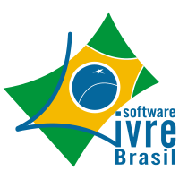

Sobre
#####

:date: 2016-01-27 23:00
:modified: 2024-05-28 00:00
:slug: sobre
:authors: Paulo Henrique de Lima Santana
:status: published

O que é videos.gnulinux.com.br?
---------------------------------

videos.gnulinux.com.br_ é um índice de vídeos de palestras em português sobre Software Livre.

Este projeto usa o código do PyVideo.org_ desenvolvido pela comunidade Python.

Onde?
-----

O código do videos.gnulinux.com.br_ está hospedado no GitHub.com_.

Quem?
-----

videos.gnulinux.com.br_ é mantido por `Paulo Henrique de Lima Santana`_.

Realizei a tradução da interface web e estou inserindo os eventos.

Contato:
--------

E-mail: paulo at phls.com.br

Palestras do FISL
-----------------

As informações das palestras do `FISL - Fórum Internacional Software Livre`_, foram gentilmente cedidas pelo Eduardo Klosowski.

O Eduardo desenvolveu o Palestrita_ para organizar os vídeos do FISL que também podem ser vistos em: palestras.gnulinux.com.br_

Apoio:
------

.. _`Paulo Henrique de Lima Santana`: http://phls.com.br
.. _`agenda.gnulinux.com.br`: http://agenda.gnulinux.com.br
.. _`timeline.gnulinux.com.br`: http://timeline.gnulinux.com.br
.. _`Paulo Henrique de Lima Santana`: http://phls.com.br
.. _`PyVideo.org`: http://pyvideo.org
.. _`GitHub.com`: https://github.com/phls/pyvideo
.. _`videos.gnulinux.com.br`: http://videos.gnulinux.com.br
.. _`pyvideo.org/pages/about.html`: http://pyvideo.org/pages/about.html
.. _`FISL - Fórum Internacional Software Livre`: http://fisl.org.br
.. _`palestras.gnulinux.com.br`: http://palestras.gnulinux.com.br
.. _`Palestrita`: https://github.com/eduardoklosowski/palestrita
