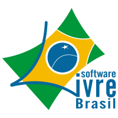

Sobre
#####

:date: 2016-01-27 23:00
:modified: 2017-07-18 00:00
:slug: sobre
:authors: Paulo Henrique de Lima Santana
:status: published

O que é videos.softwarelivre.org?
---------------------------------

videos.softwarelivre.org_ é um índice de vídeos de palestras em português sobre Software Livre.

Este projeto usa o código do PyVideo.org_ desenvolvido pela comunidade Python.

Onde?
-----

O código do videos.softwarelivre.org_ está hospedado no GitHub.com_.

Quem?
-----

videos.softwarelivre.org_ é mantido por `Paulo Henrique de Lima Santana`_.

Realizei a tradução da interface web e estou inserindo os eventos.

Gostou?
-------

Se gostou dessa iniciativa, você pode fazer uma doação de qualquer valor para mim :-)

Isso ajudará a manter este e outros projetos como a agenda.softwarelivre.org_ e a timeline.softwarelivre.org_

.. raw:: html

   <form action="https://pagseguro.uol.com.br/checkout/v2/donation.html" method="post" target="_blank">
   <input type="hidden" name="currency" value="BRL" />
   <input type="hidden" name="receiverEmail" value="phls@softwarelivre.org" />
   <input type="hidden" name="iot" value="button" />
   <input type="image" src="https://stc.pagseguro.uol.com.br/public/img/botoes/doacoes/164x37-doar-assina.gif" name="submit" alt="Pague com PagSeguro - é rápido, grátis e seguro!" />
   </form>

Contato:
--------

E-mail: phls at softwarelivre dot org

Palestras do FISL
-----------------

As informações das palestras do `FISL - Fórum Internacional Software Livre`_, foram gentilmente cedidas pelo Eduardo Klosowski.

O Eduardo desenvolveu o Palestrita_ para organizar os vídeos do FISL que também podem ser vistos em: palestras.softwarelivre.org_

Apoio:
------

.. _`Paulo Henrique de Lima Santana`: http://phls.com.br
.. _`agenda.softwarelivre.org`: http://agenda.softwarelivre.org
.. _`timeline.softwarelivre.org`: http://timeline.softwarelivre.org
.. _`Paulo Henrique de Lima Santana`: http://phls.com.br
.. _`PyVideo.org`: http://pyvideo.org
.. _`GitHub.com`: https://github.com/phls/pyvideo
.. _`videos.softwarelivre.org`: http://videos.softwarelivre.org
.. _`pyvideo.org/pages/about.html`: http://pyvideo.org/pages/about.html
.. _`FISL - Fórum Internacional Software Livre`: http://fisl.org.br
.. _`palestras.softwarelivre.org`: http://palestras.softwarelivre.org
.. _`Palestrita`: https://github.com/eduardoklosowski/palestrita
